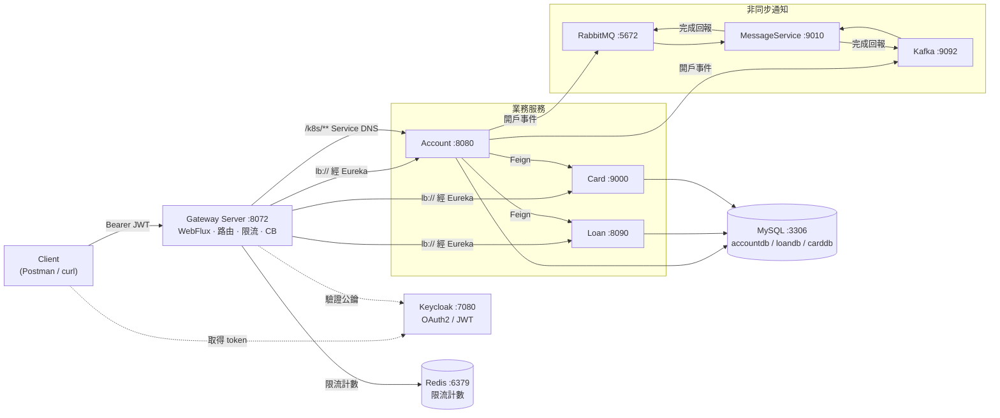
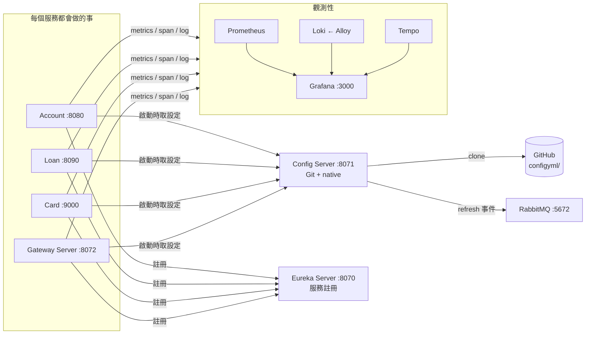
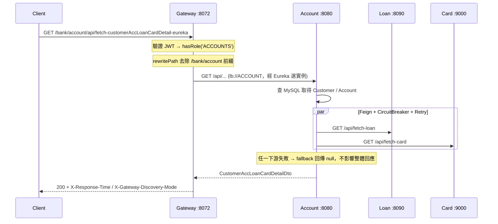
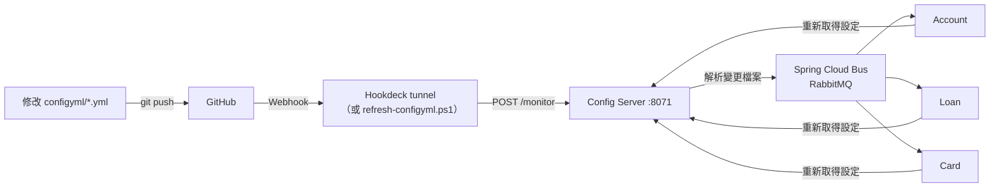
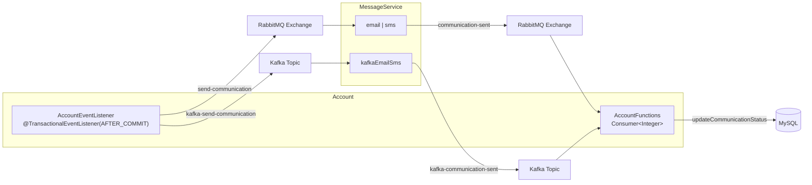

# Spring Boot Microservices — 銀行業務微服務練習專案

以「帳戶、貸款、信用卡」三個業務服務為核心，完整實作 Spring Cloud 微服務體系：集中式設定、服務發現、API Gateway、韌性機制、事件驅動訊息、OAuth2 安全與全套觀測性，並提供 **Docker Compose / Kubernetes manifests / Helm** 三種部署方式。

> 本專案以學習與實驗為目的，刻意保留多組並存的作法（Eureka vs. Kubernetes Service DNS、RabbitMQ vs. Kafka、三種 image 建置方式），方便對照比較。部分設定（開放的 Actuator 端點、提交進 git 的 `.env`）僅適用本機，不可直接用於正式環境。

---

## 目錄

- [技術棧](#技術棧)
- [系統架構](#系統架構)
- [服務一覽](#服務一覽)
- [快速開始](#快速開始)
- [對外 API](#對外-api)
- [核心機制](#核心機制)
  - [集中式設定與動態刷新](#1-集中式設定與動態刷新)
  - [服務發現的兩條路徑](#2-服務發現的兩條路徑)
  - [韌性機制](#3-韌性機制)
  - [事件驅動訊息](#4-事件驅動訊息)
  - [安全機制](#5-安全機制)
  - [觀測性](#6-觀測性)
  - [資料層](#7-資料層)
- [建置 Image](#建置-image)
- [部署方式](#部署方式)
- [專案結構](#專案結構)
- [腳本一覽](#腳本一覽)
- [疑難排解](#疑難排解)

---

## 技術棧

### 核心框架

| 項目 | 版本 | 說明 |
|---|---|---|
| Java | 25 | 所有模組統一 |
| Spring Boot | 4.1.0 | `spring-boot-starter-parent` |
| Spring Cloud | 2025.1.2 | 由 `microservices-bom` 匯入 |
| Maven Wrapper | 各模組自帶 | **無 root aggregator POM**，每個服務獨立建置 |
| Lombok | Boot 管理 | Java 23+ 需顯式宣告 `annotationProcessorPaths` |
| springdoc-openapi | 3.1.0 | Swagger UI（webmvc / webflux 兩種） |

### Spring Cloud 元件

| 元件 | 用途 |
|---|---|
| Spring Cloud Config Server + Monitor | 集中式設定，composite backend（Git 優先、native 備援） |
| Spring Cloud Bus (AMQP) | 透過 RabbitMQ 廣播設定刷新事件 |
| Netflix Eureka Server / Client | 服務註冊與發現 |
| Spring Cloud Gateway (WebFlux) | 對外單一入口、路徑改寫、限流、Circuit Breaker |
| Spring Cloud LoadBalancer | `lb://` 路由的實例選擇 |
| OpenFeign + feign-micrometer | 宣告式 HTTP client，跨服務 trace 延續 |
| Resilience4j | Circuit Breaker、Retry、RateLimiter、TimeLimiter |
| Spring Cloud Stream | RabbitMQ 與 Kafka 雙 binder |
| Spring Cloud Function | MessageService 的 `Function` 式訊息處理 |
| Spring Cloud Kubernetes Discovery Server | K8s 環境下的服務發現（3.2.0） |

### 資料與中介軟體

| 元件 | 版本 | Port（主機） | 用途 |
|---|---|---|---|
| MySQL | 8.4 | 3306 | `accountdb` / `loandb` / `carddb` |
| RabbitMQ | 4-management | 5672 / 15672 | Spring Cloud Bus + 通知訊息 |
| Apache Kafka | 4.3.1（KRaft 單節點） | 29092 / 39092 | 可重播的業務事件流 |
| Redis | 8-alpine | 6379 | Gateway RequestRateLimiter 的共用計數 |
| Keycloak | 26.7.1 | 127.0.0.1:7080 | OAuth2 授權伺服器（JWT 簽發） |

### 觀測性

| 元件 | 版本 | Port | 角色 |
|---|---|---|---|
| Grafana | 12.3.0 | 3000 | 統一查詢介面 |
| Prometheus | v3.8.0 | 9090 | 抓取 `/actuator/prometheus` 指標 |
| Loki | 3.6.2 | 3100 | Log 儲存 |
| Grafana Alloy | v1.12.0 | 12345 | 收集容器 log 寫入 Loki |
| Tempo | 2.9.0 | 3200 / 4318 / 4317 | 接收 OTLP span，提供 trace 瀑布圖 |
| Micrometer + OpenTelemetry | Boot 管理 | — | 指標與分散式追蹤 |

### 建置與部署

| 工具 | 用途 |
|---|---|
| Jib (3.5.2) | configserver、eurekaserver、card、messageservice、gatewayserver |
| Dockerfile（兩階段） | account |
| Spring Boot Buildpacks | loan |
| Docker Compose | 本機開發主要環境（`compose.yml` + `common.yml`） |
| Kubernetes manifests | `kubernetes/` |
| Helm Charts | `helm/services/` + `helm/observability/` |
| PowerShell 腳本 | 建置、推送、部署、設定刷新、限流測試 |

---

## 系統架構

架構拆成兩張圖：**業務請求路徑**是一筆 API 呼叫實際走過的地方；**平台與控制面**是每個服務啟動時或背景週期會做的事，跟單一請求無關。
兩者原本畫在同一張圖，連線交錯到難以辨識，因此分開。

### 業務請求路徑



> 只有兩條虛線：Client 取 token 與 Gateway 驗證公鑰，屬於認證流程，不算業務資料流。

### 平台與控制面



> account、loan、card、gateway 四者對 Config Server／Eureka／觀測性後端的行為完全相同，沒有任何一個是例外。
> 這張圖內每條線都是控制面，所以一律用實線，不再靠線型區分。
> metrics 由 Prometheus 拉取 `/actuator/prometheus`，span 經 OTLP 送 Tempo，log 由 Alloy 收進 Loki。

### 請求流程（以聚合查詢為例）



---

## 服務一覽

| 服務 | Port | Image 建法 | 職責 |
|---|---|---|---|
| `configserver` | 8071 | Jib | 提供集中式設定；`/monitor` 接收 webhook 並經 Bus 廣播 refresh；`/encrypt`、`/decrypt` |
| `eurekaserver` | 8070 | Jib | 單機模式服務註冊中心（不自我註冊） |
| `gatewayserver` | 8072 | Jib | 路由改寫、Circuit Breaker、Retry、Redis 限流、OAuth2 驗證、trace filter |
| `account` | 8080 | Dockerfile | 帳戶／客戶 CRUD；以 Feign 聚合 loan 與 card；發布開戶事件 |
| `loan` | 8090 | Buildpacks | 貸款 CRUD |
| `card` | 9000 | Jib | 信用卡 CRUD |
| `messageservice` | 9010 | Jib | Spring Cloud Function，模擬 email／sms 通知 |
| `microservices-bom` | — | — | 純 BOM parent：Java 版本、Spring Cloud BOM、springdoc、Jib pluginManagement |

所有業務服務採相同分層：`controller → service (I* / *ServiceImpl) → repository`，DTO 與 Entity 以靜態 `*Mapper` 轉換，例外由 `GlobalExceptionHandler` 統一處理，並各自帶 `CorrelationIdFilter`。

---

## 快速開始

### 前置需求

- Docker Desktop（建議配置 8 GB 以上記憶體；單一容器上限設為 800 MB）
- JDK 25（僅在 IDE 直接執行服務時需要）
- PowerShell 7+（所有輔助腳本）
- 專案根目錄的 `.env`（含 `ENCRYPT_KEY`、MySQL／RabbitMQ／Keycloak 帳密）

### 最短路徑：Docker Compose

```powershell
# 1. 建立七個服務的本機 image
.\build-images.ps1

# 2. 啟動核心服務
docker compose up -d

# 3. 加上觀測性套件（Loki / Alloy / Prometheus / Tempo / Grafana）
docker compose --profile observability up -d
```

### 在 IDE 直接執行

啟動順序：`configserver` → `eurekaserver` → `account` / `loan` / `card` / `messageservice` → `gatewayserver`。

```powershell
$env:ENCRYPT_KEY = "<.env 裡的值>"   # Maven / IntelliJ 不會自動讀 .env
cd account; .\mvnw.cmd spring-boot:run
```

本機模式與容器模式的差異由環境變數切換：

| 變數 | 本機預設 | 容器值 |
|---|---|---|
| `CONFIGSERVER_HOST` | `localhost` | `configserver` |
| `CONFIGSERVER_OPTIONAL_PREFIX` | `optional:` | `""`（Config Server 變成硬性依賴） |
| `EUREKA_URL` | `http://localhost:8070/eureka/` | `http://eurekaserver:8070/eureka/` |
| `SPRING_KAFKA_BOOTSTRAP_SERVERS` | `localhost:29092` | `kafka:9092` |
| `OTLP_TRACING_ENDPOINT` | `http://localhost:4318/v1/traces` | `http://tempo:4318/v1/traces` |
| `SPRING_PROFILES_ACTIVE`（Gateway） | 未設定（不驗證） | `auth`（需 JWT） |

### 驗證入口

| 用途 | URL |
|---|---|
| Eureka 註冊清單 | http://localhost:8070 |
| Config Server 合併結果 | http://localhost:8071/account/default |
| Gateway 路由清單 | http://localhost:8072/actuator/gateway/routes |
| Swagger UI（各服務） | http://localhost:8080/swagger-ui/index.html |
| RabbitMQ 管理介面 | http://localhost:15672 |
| Keycloak 管理介面 | http://localhost:7080 |
| Grafana | http://localhost:3000 |
| Prometheus | http://localhost:9090 |

---

## 對外 API

Gateway 會移除路徑前綴後轉給下游服務，並加上 `X-Response-Time` 與 `X-Gateway-Discovery-Mode` 回應 header。

| Gateway 路徑 | 目標 | 發現方式 | 附加機制 |
|---|---|---|---|
| `/bank/account/**` | Account | `lb://ACCOUNT`（Eureka） | Circuit Breaker → `forward:/contactSupport` |
| `/bank/loan/**` | Loan | `lb://LOAN`（Eureka） | GET Retry ×3，指數退避 |
| `/bank/card/**` | Card | `lb://CARD`（Eureka） | Redis 令牌桶限流（依 `user` header 分桶） |
| `/k8s/account/**` | Account | Service DNS（`downstream.account.base-url`） | 無，用於對照 Eureka |

### 服務端點

| 服務 | 端點 |
|---|---|
| Account | `POST /api/create-account`、`GET /api/fetch-account`、`PUT /api/update-account`、`DELETE /api/delete-account` |
| Account（聚合） | `GET /api/fetch-customerAccLoanCardDetail-eureka`、`GET /api/fetch-customerAccLoanCardDetail-k8s` |
| Loan | `POST /api/create-loan`、`GET /api/fetch-loan`、`PUT /api/update-loan`、`DELETE /api/delete-loan` |
| Card | `POST /api/create-card`、`GET /api/fetch-card`、`PUT /api/update-card`、`DELETE /api/delete-card` |
| 三者共同 | `GET /api/contact-info`（驗證 Config Server 設定是否生效） |
| 測試用 | Account `GET /api/test-retry`、`GET /api/test-rate-limiter`；Loan `GET /api/test-gateway-retry` |

---

## 核心機制

### 1. 集中式設定與動態刷新

Config Server 使用 **composite backend**，依序合併兩個來源，同名設定以 Git 為準：

1. **Git**（生效中）— 本 repo 的 `configyml/` 目錄，`clone-on-start: true`、`force-pull: true`
2. **native**（備援）— `configserver/src/main/resources/config/`



**必須知道的細節：**

- Git backend 讀的是 **GitHub 上的內容**，不是磁碟工作目錄 —— 改完 `configyml/*.yml` 一定要 `commit + push`，否則端點回傳舊值。
- 驗證來源：`http://localhost:8071/account/default` 的 `propertySources[].name` 顯示 GitHub URL 才代表走 Git backend。
- 敏感值以 `'{cipher}密文'`（單引號不可省）寫入，由 `ENCRYPT_KEY` 於供應設定時解密；**換金鑰會讓既有密文全部失效**，且無輪替機制。
- Config Server 自己不接收 refresh 事件（`spring.cloud.bus.refresh.enabled=false`），也不開放 `busrefresh` 入口。
- `refresh` 只適合可重新綁定的設定；`server.port`、已建立的連線池仍須重啟。

### 2. 服務發現的兩條路徑

專案刻意讓兩種服務發現並存，以便在同一份程式中對照：

| | Eureka 路徑 | Kubernetes Service DNS 路徑 |
|---|---|---|
| Feign Client | `LoanFeignClient` / `CardFeignClient` | `KubernetesLoanFeignClient` / `KubernetesCardFeignClient` |
| 宣告方式 | `@FeignClient(name = "loan")` | `@FeignClient(name = "loanKubernetes", url = "${downstream.loan.base-url}")` |
| 實例選擇 | Eureka 名冊 + Spring Cloud LoadBalancer | K8s Service selector 分流到 Ready Pod |
| Account 端點 | `/api/fetch-customerAccLoanCardDetail-eureka` | `/api/fetch-customerAccLoanCardDetail-k8s` |
| Gateway 路由 | `/bank/**` → `lb://SERVICE` | `/k8s/account/**` → base-url |

同一服務宣告多個 Feign Client 時，`contextId` 必須不同。

### 3. 韌性機制

逾時設定**由內到外遞增**，修改任一層都要一併檢查：

```
Feign（connect 1s + read 2s ≈ 3s）  →  Gateway response-timeout 7s  →  Resilience4j timelimiter 10s
```

| 機制 | 位置 | 設定 |
|---|---|---|
| Circuit Breaker | Account（Feign）、Gateway（account 路由） | 滑動視窗 5 次、最少 5 次、失敗率 50%、OPEN 10 秒、HALF_OPEN 放行 2 次 |
| Retry | Account（Feign）、Gateway（loan 路由） | 最多 4 次（含首次）、100ms 起指數退避 ×2、單次上限 1s |
| RateLimiter | Account 服務內 | 每 5 秒 1 次，記憶體計數，每個 instance 各自計算 |
| RequestRateLimiter | Gateway（card 路由） | Redis 令牌桶 `(1, 1, 1)`，依 `user` header 分桶，超量回 429 |
| TimeLimiter | Gateway | 10s，需大於 Gateway 的 HTTP timeout |
| Fallback | Account `*Fallback` 類別、Gateway `/contactSupport` | 下游失敗時回傳 null 或聯絡資訊，不讓整體查詢失敗 |

**設計取捨：** Account 停用了 CircuitBreaker 的 Feign 執行緒池（`spring.cloud.circuitbreaker.resilience4j.disable-thread-pool=true`），目的是避免執行緒切換導致 MDC 內的 correlation-id 遺失；代價是 TimeLimiter 無法中斷阻塞中的同步 Feign，等待時間改由 Feign 的 connect/read timeout 把關。

### 4. 事件驅動訊息

Account 與 MessageService 同時掛載 **RabbitMQ 與 Kafka 兩個 binder**，示範兩種訊息模型。因為 Spring Cloud Bus 固定使用 RabbitMQ，`spring.cloud.stream.defaultBinder: rabbit1` 不可省略。



- 開戶成功並 **commit 後** 才發布事件；發布失敗只記 log，不回滾已建立的帳戶（代價是該筆通知遺失，需靠 `communication_sw` 事後找出）。
- RabbitMQ 流程以 `email|sms` 函式串接（前一個函式輸出必須接得上下一個輸入），binding 名稱為 `emailsms-in-0` / `emailsms-out-0`。
- Kafka 流程為單一函式 `kafkaEmailSms`，訊息保留在 topic，可依 offset 重播。
- 所有 consumer 都設 `group`，確保多 instance 下每筆訊息只處理一次。
- Kafka 以 KRaft 單節點執行，透過三組 listener 對應不同環境：`kafka:9092`（Compose 內部）、`localhost:29092`（主機）、`host.docker.internal:39092`（本機 K8s）。

### 5. 安全機制

- Keycloak 擔任授權伺服器；Gateway 只做 **Resource Server**，驗證 JWT 但不簽發 token。
- `auth` profile 啟用 `SecurityConfig`（`@Profile("auth")`），未啟用時由 `NoAuthSecurityConfig`（`@Profile("!auth")`）全部放行，方便直接測試斷路器與限流。
- Compose 環境固定啟用 `auth`；IntelliJ 需自行加上 `-Dspring-boot.run.profiles=auth`。
- 角色控管（`KeycloakRoleConverter` 將 realm roles 轉為 Spring Security 權限）：

| 路徑 | 要求 |
|---|---|
| `/actuator/**`、`/contactSupport` | 放行 |
| `/bank/account/**`、`/k8s/account/**` | `ROLE_ACCOUNTS` |
| `/bank/loan/**` | `ROLE_LOANS` |
| `/bank/card/**` | `ROLE_CARDS` |
| 其他 | 需通過 JWT 驗證 |

API 使用 Bearer token、不依賴 Cookie，因此停用 CSRF。

### 6. 觀測性

| 訊號 | 蒐集方式 | 儲存 | 查詢 |
|---|---|---|---|
| Metrics | Micrometer → `/actuator/prometheus`（pull） | Prometheus | Grafana |
| Logs | Alloy 讀容器 log（push） | Loki | Grafana |
| Traces | OpenTelemetry → OTLP/HTTP（push） | Tempo | Grafana |

- Log pattern 內嵌 `X-Gateway-Correlation-Id`、`traceId`、`spanId`，皆自 MDC 取得。
- **Gateway 是 WebFlux，必須保留 `spring.reactor.context-propagation: auto`**，否則 Reactor 換執行緒後 MDC 為空，log 的 traceId／spanId 永遠顯示空白（Servlet 服務不需要此設定）。
- 所有服務以 `management.metrics.tags.application` 標記服務名，避免 Grafana 圖表混在一起。
- 採樣率預設 1.0（全採樣）；OTel metrics export 已關閉，指標一律走 Prometheus。

### 7. 資料層

- account／loan／card 共用同一個 MySQL 容器，分屬不同 database，由 `mysql/init/01-create-databases.sql` 於首次初始化時建立。
- 各服務啟動時以 `sql/schema.sql` 建表（`spring.sql.init.mode: always`），JPA 設為 `ddl-auto: validate`。
- **改 Entity 必須同步更新 `schema.sql`**，否則啟動時驗證失敗。
- 稽核欄位由 `BaseEntity` + `AuditAwareImpl` 自動填入。

---

## 建置 Image

三個服務採用三種不同建法，`build-images.ps1` 已封裝差異並自動從 `pom.xml` 讀取版本作為 tag（`anthonysk/<service>:<version>`）。

```powershell
.\build-images.ps1                       # 建立全部七個
.\build-images.ps1 -Services account,loan # 只建指定服務
.\build-images.ps1 -WhatIf                # 只顯示指令，不實際建置
.\push-images-to-ghcr.ps1                 # tag + push 到 ghcr.io
```

手動建置：

```powershell
# Jib（configserver / eurekaserver / card / messageservice / gatewayserver）
cd card; .\mvnw.cmd compile jib:dockerBuild        # compile 不能省，Jib 不自行編譯

# Dockerfile（account）：build context 必須是專案根目錄，才能複製 microservices-bom
docker build -f account/Dockerfile -t anthonysk/account:0.0.1-SNAPSHOT .

# Buildpacks（loan）
cd loan; .\mvnw.cmd spring-boot:build-image "-Dmaven.test.skip=true"
```

各建法的注意事項：

- Jib 的 base image 寫成 `docker://eclipse-temurin:25-jre-alpine`，會直接使用本機已存在的 image（腳本會先確認並在缺少時 pull）。
- Account 的 Dockerfile 為兩階段建置，第二階段以 JRE 執行、非 root 使用者，並用 `jarmode=tools` 分層以提升快取效果。
- Buildpacks 產出的 image 不含 `wget`／`curl`，因此 Compose 的 healthcheck 改用 bash `/dev/tcp`；另以 `BPL_JVM_THREAD_COUNT` 調整記憶體估算避免 OOM。

---

## 部署方式

### A. Docker Compose（主要開發環境）

```powershell
docker compose up -d                                      # 核心服務
docker compose --profile observability up -d              # 加上觀測性套件
docker compose -f compose.yml -f compose.prod.yml up -d   # 正式環境覆寫
docker compose up -d --force-recreate account             # 只重建單一容器
docker compose down                                       # 停止（保留 volume）
```

`common.yml` 提供 `extends` 的設定範本階層，由通用到專用：

```
resource-limits（記憶體上限 800m）
    └── spring-bus-base（RabbitMQ 連線）
            └── microservice-base（Config Server / Eureka / OTLP）
                    └── database-microservice-base（MySQL 帳密）
```

healthcheck、port 與 DB URL 因服務而異，保留在 `compose.yml`。各服務都設定固定 `container_name`，因此**不能使用 `--scale`**。

### B. Kubernetes（kubectl manifests）

外部依賴仍以 Compose 執行，只有七個 Spring 應用程式部署進 K8s：

```powershell
docker compose -f compose.k8s-infra.yml --profile observability up -d
.\build-images.ps1
.\kubernetes\import-local-images-to-k8s.ps1    # Docker 與 containerd 的 image store 不同
.\kubernetes\deploy-in-order.ps1               # 依依賴順序部署並等待就緒
.\kubernetes\restart-deployments.ps1
```

- `kubernetes/config/` 放 ConfigMap 與 Secret；`.image-load-state.json` 是匯入快取（`-Force` 可忽略）。
- 部署順序：Alloy → Secret/ConfigMap → Config Server → Eureka → 業務服務 → Gateway。

### C. Helm

```powershell
docker compose -f compose.k8s-infra.yml --profile observability up -d
.\build-images.ps1
.\kubernetes\import-local-images-to-k8s.ps1
.\helm\deploy-helm-in-order.ps1                          # 預設 namespace：helm-test
.\helm\deploy-helm-in-order.ps1 -Namespace helm-test-2 -TimeoutSeconds 600
```

- 微服務 Chart 位於 `helm/services/`（部署到 `helm-test`）；Alloy 與 Kubernetes Discovery Server 屬基礎設施，部署在 `default`。
- 每個 Chart 自行管理 ConfigMap、Deployment 與 Service，使用固定 NodePort，**切換 namespace 前必須先停掉另一組**，否則 port 衝突。
- kubectl 與 Helm 不能同時管理同一份 Alloy，腳本會先移除對應的 Helm Release。

---

## 專案結構

```
springboot-microservices/
├── microservices-bom/        # 共用 parent POM（版本管理 + Jib pluginManagement）
├── account/                  # 帳戶／客戶（含 Dockerfile）
├── loan/                     # 貸款
├── card/                     # 信用卡
├── configserver/             # Config Server（含 native 備援設定）
├── eurekaserver/             # 服務註冊中心
├── gatewayserver/            # API Gateway
├── messageservice/           # 通知服務（Spring Cloud Function）
├── configyml/                # ★ Config Server 的 Git backend 來源（account / loan / card）
├── compose.yml               # 主要 Compose 定義
├── common.yml                # Compose extends 設定範本
├── compose.prod.yml          # 正式環境覆寫
├── compose.k8s-infra.yml     # K8s 開發用的外部依賴
├── kubernetes/               # kubectl manifests + 部署腳本
├── helm/                     # Helm Charts（services / observability）
├── observability-config/     # Alloy / Grafana / Prometheus / Tempo 設定
├── mysql/init/               # 資料庫初始化 SQL
├── .env                      # ENCRYPT_KEY 與各項帳密（Compose 自動讀取）
└── *.ps1                     # 建置、推送、部署、刷新、測試腳本
```

---

## 腳本一覽

| 腳本 | 用途 |
|---|---|
| `build-images.ps1` | 依各服務的建法建立本機 image（支援 `-Services`、`-WhatIf`） |
| `push-images-to-ghcr.ps1` | 將本機 image tag 並推送到 ghcr.io（需先 `docker login ghcr.io`） |
| `refresh-configyml.ps1` | 模擬 GitHub webhook 呼叫 `/monitor`，觸發 Bus refresh（`-Service` / `-All`） |
| `hookdeck-listen.ps1` | 建立 Hookdeck tunnel，讓真正的 GitHub webhook 送達本機 Config Server |
| `test-ratelimit-gateway.ps1` | 連續呼叫 Card 路由，驗證 Redis 限流（`-User`、`-Count`） |
| `test-ratelimit-service.ps1` | 直接呼叫 Account 8080，驗證服務內 `@RateLimiter` |
| `kubernetes/import-local-images-to-k8s.ps1` | 將 Docker image 匯入 K8s 節點的 containerd |
| `kubernetes/deploy-in-order.ps1` | 依依賴順序套用 manifests 並等待就緒 |
| `kubernetes/restart-deployments.ps1` | 重啟 Deployment |
| `helm/deploy-helm-in-order.ps1` | 依序安裝／升級所有 Helm Release |

### 測試

```powershell
cd account; .\mvnw.cmd test                                            # 全部測試
cd account; .\mvnw.cmd test "-Dtest=AccountApplicationTests"            # 單一類別
cd account; .\mvnw.cmd test "-Dtest=AccountApplicationTests#contextLoads"  # 單一方法
```

目前僅有 Spring Initializr 產生的 7 個 context smoke test；它們會嘗試連線 Config Server／MySQL／RabbitMQ，離線時通常失敗，因此 image 建置流程一律略過測試。

---

## 疑難排解

| 症狀 | 原因與處理 |
|---|---|
| 改了 `configyml/*.yml` 但端點值沒變 | Git backend 讀 GitHub 內容，必須 `commit + push`；確認不是誤改 `configserver/src/main/resources/config/` 的 native 備援 |
| 服務啟動報解密失敗 | `ENCRYPT_KEY` 未設定或已更換；IntelliJ 需手動 `$env:ENCRYPT_KEY=...`，Compose 才會自動讀 `.env` |
| `docker compose up` 立即失敗並提示缺少變數 | 根目錄缺少 `.env` 或其中某個必填變數 |
| 容器啟動時連不上 Config Server 而失敗 | 容器將 `CONFIGSERVER_OPTIONAL_PREFIX` 設為空字串，Config Server 是硬性依賴，需先確認其健康狀態 |
| Gateway log 的 `traceId` / `spanId` 永遠空白 | 缺少 `spring.reactor.context-propagation: auto`（WebFlux 專屬） |
| 呼叫 API 回 401／403 | Compose 的 Gateway 固定啟用 `auth` profile，需帶 Keycloak token 且具備對應 realm role |
| 呼叫 Card 路由頻繁回 429 | Gateway 令牌桶為每個 `user` header 每秒 1 個請求；未帶 header 時共用 `anonymous` 桶 |
| 服務啟動時 schema 驗證失敗 | Entity 與 `sql/schema.sql` 不一致（`ddl-auto: validate`） |
| K8s 拉到舊版 image | Docker 與 containerd image store 不同，需執行 `import-local-images-to-k8s.ps1`（必要時加 `-Force`） |
| Helm 切換 namespace 後 Pod 起不來 | NodePort 為固定值，需先停掉另一組 Release |
| Kafka 啟動失敗或連不上 | KRaft 單節點副本數必須為 1；確認使用了與環境相符的 listener（9092 / 29092 / 39092） |

---

## 已知的刻意取捨

本專案為練習用途，以下設定**不適用於正式環境**：

- `.env` 直接提交進 git（正式環境應使用真正的 secret 管理）。
- Actuator 開放 `env`（`show-values: ALWAYS`）、`refresh`、`busrefresh`、`shutdown`（`access: unrestricted`）等端點且未加保護。
- Config Server 的 `/encrypt`、`/decrypt` 為公開 POST 端點。
- Keycloak 以 `start-dev` 模式搭配內建 H2 執行，不要求 HTTPS。
- Trace 採樣率為 100%。
- Eureka 為單機模式，Kafka 為單節點無副本。
