# Spring Boot Microservices — 銀行業務微服務練習專案

> **Java 25 × Spring Boot 4.1 × Spring Cloud 2025.1** 打造的微服務對照實驗場 — 帳戶／貸款／信用卡三個業務服務，串起集中式設定、服務發現、API Gateway、韌性機制、事件驅動訊息、OAuth2 安全與全套觀測性。

<p>
  
  
  
  
  
  
</p>
<p>
  
  
  
  
  
</p>
<p>
  
  
  
  
  
  
</p>

三個業務服務（account／loan／card）加上四個平台服務（Config Server、Eureka、Gateway、MessageService）。一筆聚合查詢會依序穿過 JWT 驗證、路徑改寫、Eureka 選實例、Feign 併發呼叫、Circuit Breaker 與 fallback，最後落到 MySQL；開戶則另外走 RabbitMQ 與 Kafka 兩條訊息通道回報通知狀態。

**這個 repo 的重點不在業務複雜度，而在「同一件事刻意用多種作法並陳」**，方便直接對照差異：

| 對照組 | A | B |
|---|---|---|
| 服務發現 | Eureka + LoadBalancer（`lb://`） | Kubernetes Service DNS（固定 base-url） |
| 訊息中介 | RabbitMQ（Spring Cloud Bus 也走這條） | Kafka（可依 offset 重播） |
| Image 建法 | Jib ／ Dockerfile ／ Buildpacks 三種並存 | — |
| 執行環境 | Docker Compose ／ kubectl manifests ／ Helm 三套 | — |

| 服務 | Port | 定位 |
|---|---|---|
| `configserver` | 8071 | 集中式設定，`/monitor` 觸發 Bus 廣播刷新 |
| `eurekaserver` | 8070 | 服務註冊中心 |
| `gatewayserver` | 8072 | 對外單一入口（WebFlux） |
| `account` | 8080 | 帳戶／客戶，聚合 loan 與 card |
| `loan` | 8090 | 貸款 |
| `card` | 9000 | 信用卡 |
| `messageservice` | 9010 | Spring Cloud Function，email／sms 通知 |
| `microservices-bom` | — | 純 BOM parent，不可部署 |

> `microservices-bom` 是共用的 **parent POM**（`dependencyManagement` + `pluginManagement`），各服務以 `<relativePath>` 繼承它。
> 但它**不是 aggregator** —— 沒有 `<modules>`，根目錄也沒有 `pom.xml`，所以無法從任何一處一次建置七個服務，必須進到各自目錄執行 `mvnw`。

> 本專案以學習與實驗為目的。部分設定（開放的 Actuator 端點、提交進 git 的 `.env`、`start-dev` 模式的 Keycloak）僅適用本機，**不可直接用於正式環境** — 完整清單見 [已知的刻意取捨](#已知的刻意取捨)。
> 遇到問題？ → [疑難排解](#疑難排解)

---

## 目錄

1. [視覺展示](#1-視覺展示)
2. [系統架構與專案結構](#2-系統架構與專案結構)
3. [核心功能與亮點](#3-核心功能與亮點)
4. [技術棧](#4-技術棧)
5. [快速開始與本地部署](#5-快速開始與本地部署)
6. [附錄](#6-附錄)

---

## 1. 視覺展示

### 一筆聚合查詢的完整旅程

`GET /bank/account/api/fetch-customerAccLoanCardDetail-eureka` 這一條路徑同時用到 JWT 驗證、路徑改寫、Eureka 選實例、Feign 併發呼叫、Circuit Breaker 與 fallback —— 幾乎是本專案所有機制的縮影。

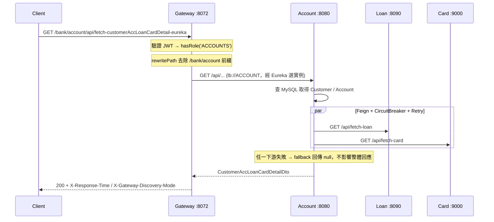

### 畫面截圖

#### 一筆請求的日誌與 trace 並排

**Grafana Explore — Loki × Tempo** — 左側是 account 的即時日誌，右側是**同一筆請求**的 trace 瀑布圖：`gatewayserver: http get`、**13 個 span 跨 4 個服務、共 108.16ms**。可以看到 `security filterchain`（6.66ms）→ `account http get`（88.99ms）→ `circuit-breaker` → `loan`（13.49ms）與 `card`（13.36ms）的巢狀結構。左側日誌裡的 `LoanFeignClient#fetchLoanDetails --> GET http://loan/api/fetch-loan` 就是右側那段 span，兩邊靠 traceId 對得起來。

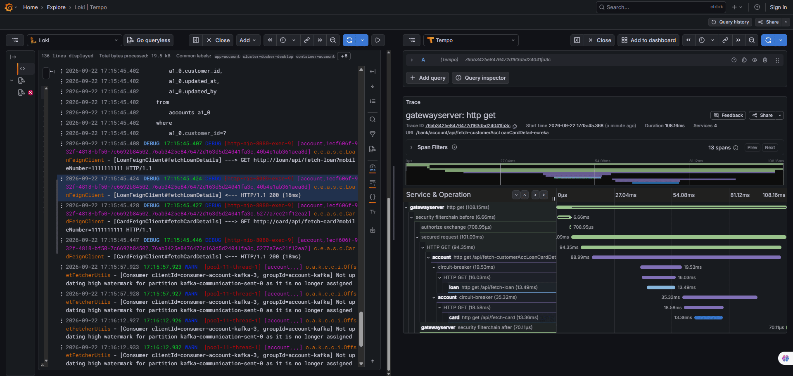

<details>
<summary><b>🧭 服務發現與閘道 — Eureka 名冊、Gateway 路由</b></summary>

<br>

**Eureka 註冊清單** — `http://localhost:8070`。`ACCOUNT` 1 個、`CARD` 2 個、`LOAN` 2 個、`GATEWAYSERVER` 1 個實例，狀態全為 UP。實例 ID 直接就是 Kubernetes 的 Pod 名稱（`account-deployment-5cf87ccd7f-glv9f:account:8080`），可以直接對應到下方 Headlamp 的畫面。

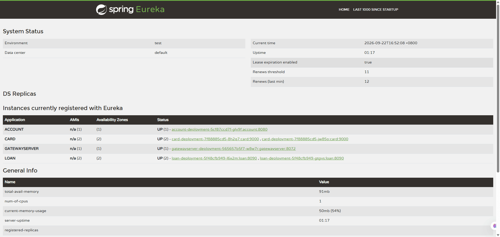

**Gateway 路由表** — `http://localhost:8072/actuator/gateway/routes`。四條路由與各自的 filter 一次看清，也是 [§3 兩條服務發現路徑](#-兩條服務發現路徑刻意並存)在執行期的樣子：三條 `/bank/**` 指向 `lb://ACCOUNT`／`lb://LOAN`／`lb://CARD`（Eureka），`/k8s/account/**` 則直接指向 `http://account:8080`（Service DNS），回應 header `X-Gateway-Discovery-Mode` 因此分別是 `eureka` 與 `service-dns`。每條路由的容錯機制也不同——account 掛 `accountCircuitBreaker` 並 fallback 到 `forward:/contactSupport`，loan 是 `Retry`（`retries=3`、僅 GET、`PT0.1S → PT1S` 指數退避 `factor=2`），card 則是 `RequestRateLimiter`。

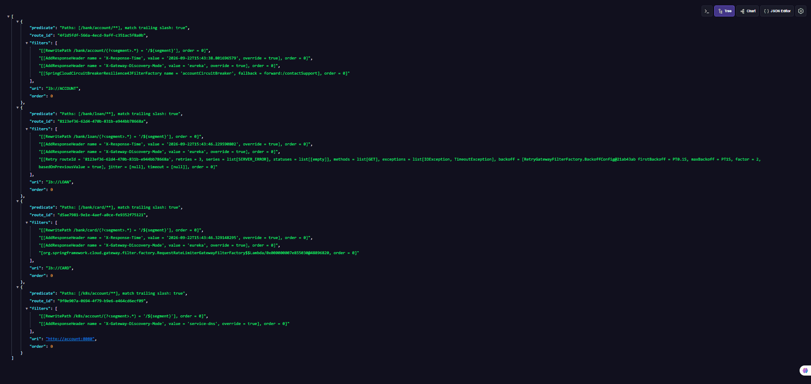

</details>

<details>
<summary><b>☸️ 執行環境 — Kubernetes 工作負載與 Compose 基礎設施</b></summary>

<br>

**Headlamp — `default` namespace** — 八個 Deployment 全部 Available，`card` 與 `loan` 各 2 個副本，image 統一取自本機的 `anthonysk/<service>:0.0.1-SNAPSHOT`，另有一個 `spring-cloud-kubernetes-discoveryserver`。

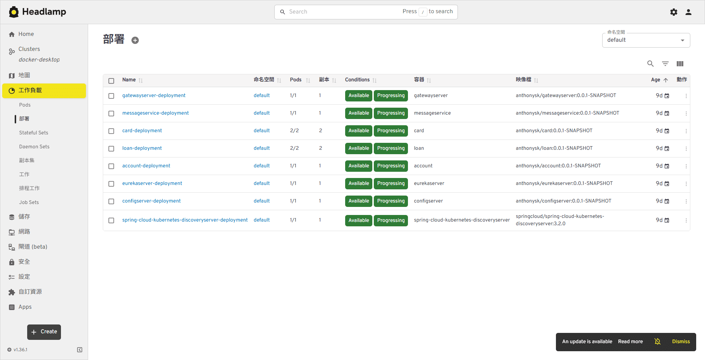

**Docker Desktop — Compose 的外部依賴** — kubectl 模式下七個 Spring 服務跑在 K8s，外部依賴仍留在 Compose：MySQL、RabbitMQ、Kafka、Redis、Keycloak，加上觀測性套件 Loki／Alloy／Prometheus／Tempo／Grafana。

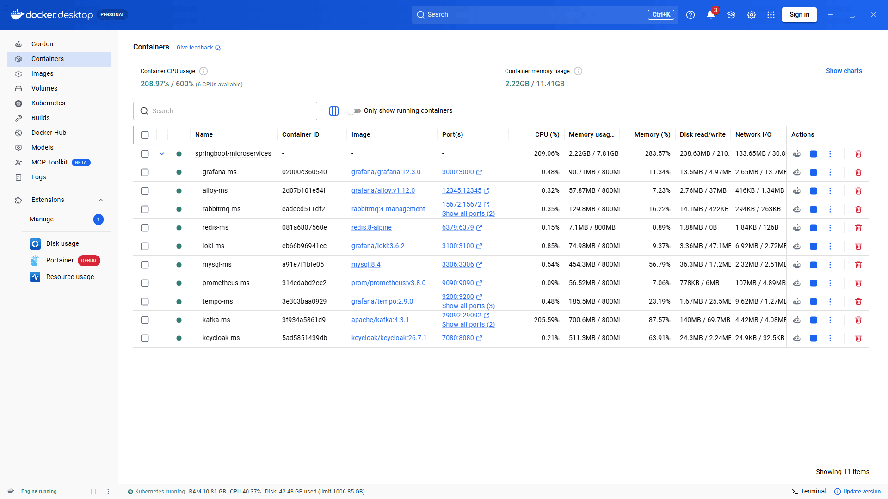

</details>

<details>
<summary><b>🔭 觀測性 — 指標查詢與 JVM 儀表板</b></summary>

<br>

**Grafana Explore — Prometheus** — `process_uptime_seconds` 疊圖，七個服務各一條序列，靠 `application` 與 `job` 標籤區分（`management.metrics.tags.application` 的作用就在這裡）。

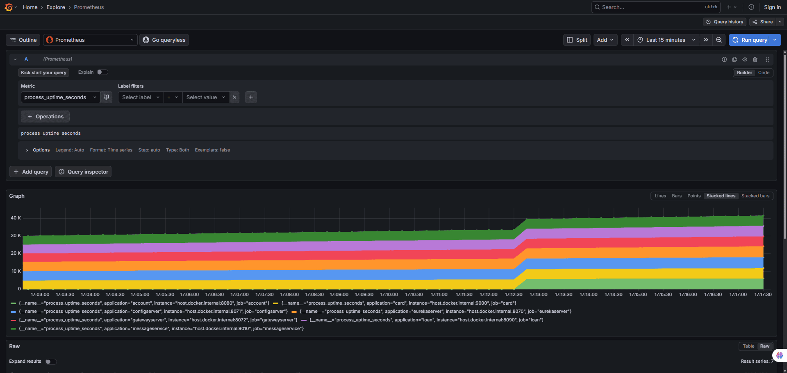

**Grafana Dashboard — JVM (Micrometer)** — 以 `Application=account`、`Instance=host.docker.internal:8080` 過濾，Heap／Non-Heap 使用率、HTTP rate 與 duration 一次看完。

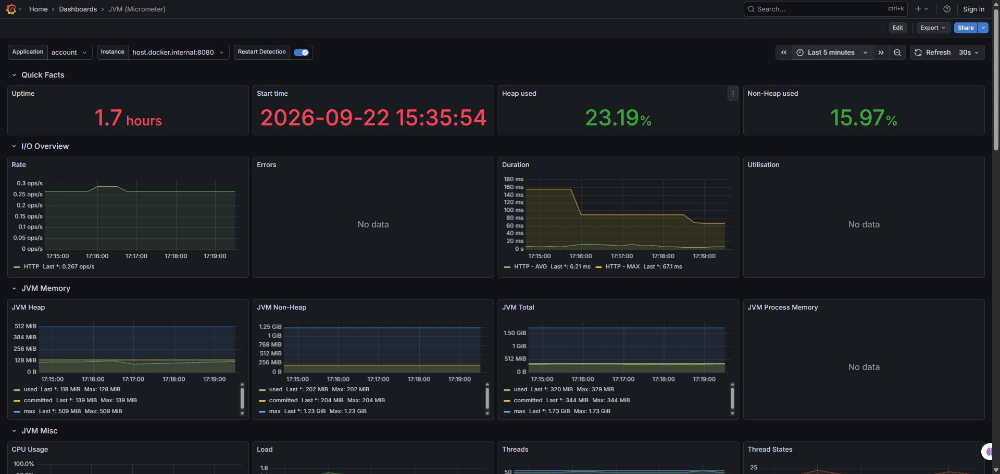

**Prometheus 原生 UI** — 同一個查詢在 `http://localhost:9090`。排查 target 抓不到時，這裡的 `Status → Targets` 比 Grafana 直接。

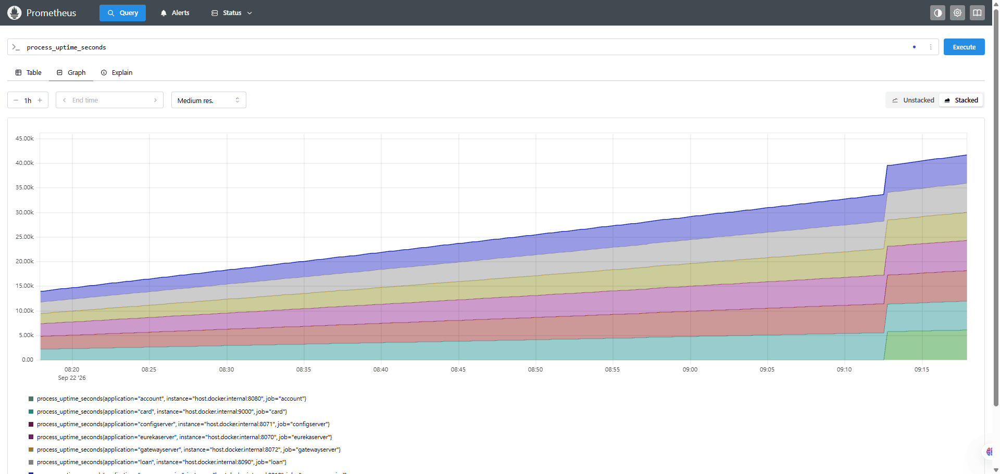

</details>

---

## 2. 系統架構與專案結構

### 全景架構圖

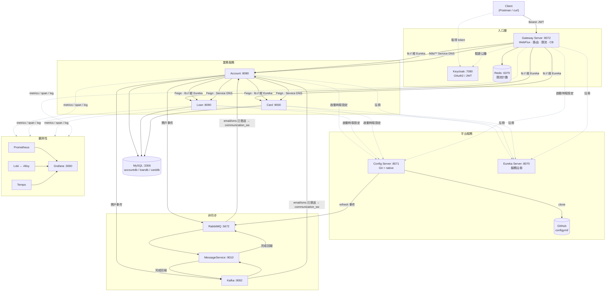

> **圖例**：**深色實線**＝主要業務路徑，一筆請求實際走過的地方（Client → Gateway → 各服務 → MySQL／MQ）；**灰色虛線**＝次要的控制面流量，只在啟動時或背景週期發生。
>
> account、loan、card、gateway 四者對 Config Server／Eureka／觀測性後端的行為**完全相同**，四條線都是虛線，沒有任何一個是例外。

### 服務一覽

| 服務 | Port | Image 建法 | 職責 |
|---|---|---|---|
| `configserver` | 8071 | Jib | 提供集中式設定；`/monitor` 接收 webhook 並經 Bus 廣播 refresh；`/encrypt`、`/decrypt` |
| `eurekaserver` | 8070 | Jib | 單機模式服務註冊中心（不自我註冊） |
| `gatewayserver` | 8072 | Jib | 路由改寫、Circuit Breaker、Retry、Redis 限流、OAuth2 驗證、trace filter |
| `account` | 8080 | Dockerfile | 帳戶／客戶 CRUD；以 Feign 聚合 loan 與 card；發布開戶事件 |
| `loan` | 8090 | Buildpacks | 貸款 CRUD |
| `card` | 9000 | Jib | 信用卡 CRUD |
| `messageservice` | 9010 | Jib | Spring Cloud Function，模擬 email／sms 通知 |
| `microservices-bom` | — | — | 純 BOM parent：Java 版本、Spring Cloud BOM、springdoc、Jib pluginManagement |

### 分層慣例

所有業務服務採相同分層：`controller → service (I* / *ServiceImpl) → repository`，DTO 與 Entity 以靜態 `*Mapper` 轉換，例外由 `GlobalExceptionHandler` 統一處理，並各自帶 `CorrelationIdFilter`。

### 專案結構

```
springboot-microservices/
├── microservices-bom/        # 共用 parent POM（版本管理 + Jib pluginManagement）
├── account/                  # 帳戶／客戶（含 Dockerfile）
├── loan/                     # 貸款
├── card/                     # 信用卡
├── configserver/             # Config Server（含 native 備援設定）
├── eurekaserver/             # 服務註冊中心
├── gatewayserver/            # API Gateway
├── messageservice/           # 通知服務（Spring Cloud Function）
├── configyml/                # ★ Config Server 的 Git backend 來源（account / loan / card）
├── docs/screenshots/         # README 使用的畫面截圖
├── compose.yml               # 主要 Compose 定義
├── common.yml                # Compose extends 設定範本
├── compose.prod.yml          # 正式環境覆寫
├── compose.k8s-infra.yml     # K8s 開發用的外部依賴
├── kubernetes/               # kubectl manifests + 部署腳本
├── helm/                     # Helm Charts（services / observability）
├── observability-config/     # Alloy / Grafana / Prometheus / Tempo 設定
├── mysql/init/               # 資料庫初始化 SQL
├── .env                      # ENCRYPT_KEY 與各項帳密（Compose 自動讀取）
└── *.ps1                     # 建置、推送、部署、刷新、測試腳本
```

---

## 3. 核心功能與亮點

本節只談**為什麼這樣設計**與各機制的取捨；實際指令一律在 [§5 快速開始與本地部署](#5-快速開始與本地部署)。

| 主題 | 一句話 |
|---|---|
| [🔀 兩條服務發現路徑刻意並存](#-兩條服務發現路徑刻意並存) | 同一份程式同時用 Eureka 與 K8s Service DNS 呼叫下游 |
| [⚙️ 集中式設定與動態刷新](#️-集中式設定與動態刷新) | Git backend 讀的是 GitHub，不是磁碟 |
| [🛡️ 由內到外的逾時鏈](#️-由內到外的逾時鏈) | Feign 3s → Gateway 7s → TimeLimiter 10s，順序不能亂 |
| [📨 RabbitMQ 與 Kafka 雙 binder 並掛](#-rabbitmq-與-kafka-雙-binder-並掛) | Bus 固定走 Rabbit，業務事件兩條都走 |
| [🔐 可一鍵關閉的 OAuth2 安全層](#-可一鍵關閉的-oauth2-安全層) | `auth` profile 切換兩份 SecurityConfig |
| [🔭 三訊號觀測性與 correlation-id 貫穿](#-三訊號觀測性與-correlation-id-貫穿) | WebFlux 少一行設定，traceId 就永遠空白 |
| [🗄️ schema.sql 是 schema 的唯一真相](#️-schemasql-是-schema-的唯一真相) | `ddl-auto: validate` 只驗不建 |
| [📦 一個 repo，三種 image 建法](#-一個-repo三種-image-建法) | Jib／Dockerfile／Buildpacks 各有各的坑 |
| [☸️ 一套應用，三種執行環境](#️-一套應用三種執行環境) | Compose／kubectl／Helm 的真正差異在哪 |

### 🔀 兩條服務發現路徑刻意並存

Account 對 loan 與 card 各準備了兩組 Feign Client。**兩組都是 Feign，差別只在目標位址怎麼解析**：

| | Eureka 路徑 | Kubernetes Service DNS 路徑 |
|---|---|---|
| Feign Client | `LoanFeignClient` / `CardFeignClient` | `KubernetesLoanFeignClient` / `KubernetesCardFeignClient` |
| 宣告方式 | `@FeignClient(name = "loan")` | `@FeignClient(name = "loanKubernetes", url = "${downstream.loan.base-url}")` |
| 實例選擇 | Eureka 名冊 + Spring Cloud LoadBalancer | K8s Service selector 分流到 Ready Pod |
| Account 端點 | `/api/fetch-customerAccLoanCardDetail-eureka` | `/api/fetch-customerAccLoanCardDetail-k8s` |
| Gateway 路由 | `/bank/**` → `lb://SERVICE` | `/k8s/account/**` → base-url |

```java
@FeignClient(name = "loan", fallback = LoanFallback.class)
// 只有 name、沒有 url → 交給 LoadBalancer 去 Eureka 名冊挑一個實例
public interface LoanFeignClient { ... }

@FeignClient(
        name = "loanKubernetes",
        contextId = "kubernetesLoanFeignClient",   // 同一服務宣告多個 Client 時必須不同，否則 bean 名稱衝突
        url = "${downstream.loan.base-url:http://localhost:8090}",  // 帶了 url → Feign 完全跳過服務發現
        fallback = KubernetesLoanFallback.class
)
public interface KubernetesLoanFeignClient { ... }
```

因為第二條路徑不查 Eureka，**Eureka 沒啟動時它照樣能呼叫**，但 loan／card 的 Service 必須可連線。

### ⚙️ 集中式設定與動態刷新

Config Server 使用 **composite backend**，依序合併兩個來源，同名設定以 Git 為準：

1. **Git**（生效中）— 本 repo 的 `configyml/` 目錄，`clone-on-start: true`、`force-pull: true`
2. **native**（備援）— `configserver/src/main/resources/config/`

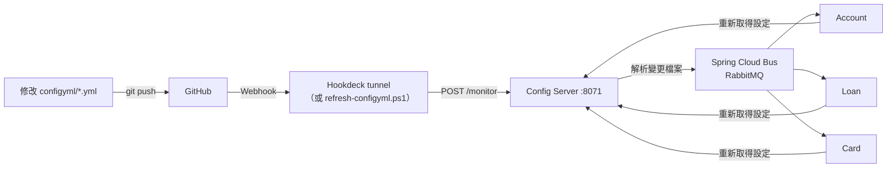

**必須知道的細節：**

- Git backend 讀的是 **GitHub 上的內容**，不是磁碟工作目錄 —— 改完 `configyml/*.yml` 一定要 `commit + push`，否則端點回傳舊值。
- 驗證來源：`http://localhost:8071/account/default` 的 `propertySources[].name` 顯示 GitHub URL 才代表走 Git backend。
- 敏感值以 `'{cipher}密文'` 寫入，由 `ENCRYPT_KEY` 於供應設定時解密。**單引號不可省**；**換金鑰會讓既有密文全部失效**，且無輪替機制。
- Config Server 自己不接收 refresh 事件（`spring.cloud.bus.refresh.enabled=false`），也不開放 `busrefresh` 入口。
- `refresh` 只適合可重新綁定的設定；`server.port`、已建立的連線池仍須重啟。

```yaml
# configyml/account.yml —— 單引號不可省，少了它 YAML 會把 {cipher} 當成 flow mapping
accounts:
  message: '{cipher}AQBx7t2f...'
```

### 🛡️ 由內到外的逾時鏈

逾時設定**由內到外遞增**，修改任一層都要一併檢查：

```
Feign（connect 1s + read 2s ≈ 3s）  →  Gateway response-timeout 7s  →  Resilience4j timelimiter 10s
```

| 機制 | 位置 | 設定 |
|---|---|---|
| Circuit Breaker | Account（Feign）、Gateway（account 路由） | 滑動視窗 5 次、最少 5 次、失敗率 50%、OPEN 10 秒、HALF_OPEN 放行 2 次 |
| Retry | Account（Feign）、Gateway（loan 路由） | 最多 4 次（含首次）、100ms 起指數退避 ×2、單次上限 1s |
| RateLimiter | Account 服務內 | 每 5 秒 1 次，記憶體計數，每個 instance 各自計算 |
| RequestRateLimiter | Gateway（card 路由） | Redis 令牌桶 `(1, 1, 1)`，依 `user` header 分桶，超量回 429 |
| TimeLimiter | Gateway | 10s，需大於 Gateway 的 HTTP timeout |
| Fallback | Account `*Fallback` 類別、Gateway `/contactSupport` | 下游失敗時回傳 null 或聯絡資訊，不讓整體查詢失敗 |

**設計取捨：** Account 停用了 CircuitBreaker 的 Feign 執行緒池（`spring.cloud.circuitbreaker.resilience4j.disable-thread-pool=true`），目的是避免執行緒切換導致 MDC 內的 correlation-id 遺失；代價是 TimeLimiter 無法中斷阻塞中的同步 Feign，等待時間改由 Feign 的 connect/read timeout 把關。

### 📨 RabbitMQ 與 Kafka 雙 binder 並掛

Account 與 MessageService 同時掛載 **RabbitMQ 與 Kafka 兩個 binder**，示範兩種訊息模型。因為 Spring Cloud Bus 固定使用 RabbitMQ，`spring.cloud.stream.defaultBinder: rabbit1` 不可省略。

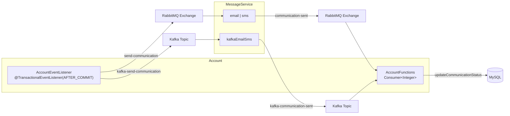

- 開戶成功並 **commit 後** 才發布事件；發布失敗只記 log，不回滾已建立的帳戶。代價是該筆通知遺失 —— 事後要靠 `communication_sw IS NULL` 找出「開戶成功但沒通知到」的帳戶。
- 迴圈的終點在 Account 自己：MessageService 回報到 `communication-sent` / `kafka-communication-sent`，Account 的 Consumer 收到後把 `communication_sw` 標記為已送達。
- RabbitMQ 流程以 `email|sms` 函式串接（前一個函式輸出必須接得上下一個輸入），binding 名稱為 `emailsms-in-0` / `emailsms-out-0`。
- Kafka 流程為單一函式 `kafkaEmailSms`，訊息保留在 topic，可依 offset 重播。
- 所有 consumer 都設 `group`，確保多 instance 下每筆訊息只處理一次。

Kafka 以 KRaft 單節點執行，透過三組 listener 對應不同環境：

| Listener | 位址 | 使用者 |
|---|---|---|
| 內部 | `kafka:9092` | Compose 網路內的容器 |
| 主機 | `localhost:29092` | 在 IDE 直接執行的服務 |
| 跨界 | `host.docker.internal:39092` | 本機 K8s 內的 Pod 回連主機 |

### 🔐 可一鍵關閉的 OAuth2 安全層

Keycloak 擔任授權伺服器；Gateway 只做 **Resource Server**，驗證 JWT 但不簽發 token。安全層由兩份互斥的設定類別組成，切換 profile 即可整層關閉：

```java
@Configuration
@Profile("auth")      // 啟用時走完整 JWT 驗證與角色控管
public class SecurityConfig { ... }

@Configuration
@Profile("!auth")     // 未啟用時全部放行，方便直接測斷路器與限流
public class NoAuthSecurityConfig { ... }
```

Compose 環境固定啟用 `auth`；IntelliJ 需自行加上 `-Dspring-boot.run.profiles=auth`。角色由 `KeycloakRoleConverter` 將 realm roles 轉為 Spring Security 權限：

| 路徑 | 要求 |
|---|---|
| `/actuator/**`、`/contactSupport` | 放行 |
| `/bank/account/**`、`/k8s/account/**` | `ROLE_ACCOUNTS` |
| `/bank/loan/**` | `ROLE_LOANS` |
| `/bank/card/**` | `ROLE_CARDS` |
| 其他 | 需通過 JWT 驗證 |

API 使用 Bearer token、不依賴 Cookie，因此停用 CSRF。

### 🔭 三訊號觀測性與 correlation-id 貫穿

| 訊號 | 蒐集方式 | 儲存 | 查詢 |
|---|---|---|---|
| Metrics | Micrometer → `/actuator/prometheus`（pull） | Prometheus | Grafana |
| Logs | Alloy 讀容器 log（push） | Loki | Grafana |
| Traces | OpenTelemetry → OTLP/HTTP（push） | Tempo | Grafana |

Log pattern 內嵌三個識別碼，全部自 MDC 取得，因此一行 log 就能跳到對應的 trace：

```
%X{X-Gateway-Correlation-Id}  # 由各服務的 CorrelationIdFilter 放入
%X{traceId}  %X{spanId}       # 由 Micrometer Tracing 放入
```

- **Gateway 是 WebFlux，必須保留 `spring.reactor.context-propagation: auto`**，否則 Reactor 換執行緒後 MDC 為空，log 的 traceId／spanId 永遠顯示空白（Servlet 服務不需要此設定）。這是整份文件最容易踩、也最難察覺的一條。
- 所有服務以 `management.metrics.tags.application` 標記服務名，避免 Grafana 圖表混在一起。
- 採樣率預設 1.0（全採樣）；OTel metrics export 已關閉，指標一律走 Prometheus。

### 🗄️ schema.sql 是 schema 的唯一真相

account／loan／card 共用同一個 MySQL 容器，分屬不同 database，建立過程分兩段：

| 階段 | 執行者 | 做什麼 |
|---|---|---|
| 容器首次初始化 | `mysql/init/01-create-databases.sql` | 建立 `accountdb` / `loandb` / `carddb` 三個 database |
| 各服務啟動時 | `sql/schema.sql`（`spring.sql.init.mode: always`） | 在自己的 database 內建表 |

JPA 設為 `ddl-auto: validate`，**只驗證、不建立也不修改**。因此 **改 Entity 必須同步更新 `schema.sql`**，否則啟動時驗證失敗。稽核欄位由 `BaseEntity` + `AuditAwareImpl` 自動填入。

### 📦 一個 repo，三種 image 建法

| 建法 | 服務 | 特性 | 必踩的坑 |
|---|---|---|---|
| Jib | configserver、eurekaserver、card、messageservice、gatewayserver | 不需要 Docker daemon 參與編譯，分層快取好 | base image 寫成 `docker://eclipse-temurin:25-jre-alpine`，直接取用本機已存在的 image，缺少時要先 pull |
| Dockerfile | account | 兩階段建置，第二階段以 JRE 執行、非 root 使用者，並用 `jarmode=tools` 分層 | **build context 必須是專案根目錄**，否則複製不到 `microservices-bom/` |
| Buildpacks | loan | 零設定，由 Paketo 自動偵測 | 產出的 image 不含 `wget`／`curl`，Compose healthcheck 改用 bash `/dev/tcp`；另以 `BPL_JVM_THREAD_COUNT` 調整記憶體估算避免 OOM |

`build-images.ps1` 已封裝三者差異，並自動從各服務 `pom.xml` 讀取版本作為 tag（`anthonysk/<service>:<version>`）。指令見 [§5 手動建置 Image](#手動建置-image)。

### ☸️ 一套應用，三種執行環境

| | Docker Compose | kubectl manifests | Helm |
|---|---|---|---|
| 外部依賴位置 | 全部在同一份 `compose.yml` | 仍跑在 Compose（`compose.k8s-infra.yml`），只有七個 Spring 應用進 K8s | 同 kubectl |
| 設定來源 | Compose 環境變數 + Config Server | `kubernetes/config/` 的 ConfigMap／Secret + Config Server | 各 Chart 自帶 ConfigMap + Config Server |
| 服務發現 | Eureka（`lb://`） | Eureka 與 Service DNS 並存 | 同 kubectl |
| Port 暴露 | 直接映射到主機 | Service（含固定 NodePort） | Service（固定 NodePort） |

三者共同的限制：

- Compose 每個服務都設定固定 `container_name`，因此**不能使用 `--scale`**。
- Helm 的微服務 Chart 使用固定 NodePort，**切換 namespace 前必須先停掉另一組**，否則 port 衝突。
- kubectl 與 Helm 不能同時管理同一份 Alloy，腳本會先移除對應的 Helm Release。
- Docker 與 containerd 的 image store 不同，K8s 兩種環境都必須先執行 image 匯入步驟。

---

## 4. 技術棧

### 核心框架

| 項目 | 版本 | 說明 |
|---|---|---|
| Java | 25 | 所有模組統一 |
| Spring Boot | 4.1.0 | `spring-boot-starter-parent` |
| Spring Security | 7.1.0 | 由 Boot 託管；Gateway 作為 Resource Server 驗證 JWT |
| Spring Cloud | 2025.1.2 | 由 `microservices-bom` 匯入 |
| Maven Wrapper | 3.9.16 | 各模組自帶；有共用 parent 但**無 aggregator**，每個服務獨立建置 |
| Lombok | Boot 管理 | Java 23+ 需顯式宣告 `annotationProcessorPaths` |
| springdoc-openapi | 3.1.0 | Swagger UI（webmvc / webflux 兩種） |

### Spring Cloud 元件

| 元件 | 用途 |
|---|---|
| Spring Cloud Config Server + Monitor | 集中式設定，composite backend（Git 優先、native 備援） |
| Spring Cloud Bus (AMQP) | 透過 RabbitMQ 廣播設定刷新事件 |
| Netflix Eureka Server / Client | 服務註冊與發現 |
| Spring Cloud Gateway (WebFlux) | 對外單一入口、路徑改寫、限流、Circuit Breaker |
| Spring Cloud LoadBalancer | `lb://` 路由的實例選擇 |
| OpenFeign + feign-micrometer | 宣告式 HTTP client，跨服務 trace 延續 |
| Resilience4j | Circuit Breaker、Retry、RateLimiter、TimeLimiter |
| Spring Cloud Stream | RabbitMQ 與 Kafka 雙 binder |
| Spring Cloud Function | MessageService 的 `Function` 式訊息處理 |
| Spring Cloud Kubernetes Discovery Server | K8s 環境下的服務發現（3.2.0） |

### 資料與中介軟體

| 元件 | 版本 | Port（主機） | 用途 |
|---|---|---|---|
| MySQL | 8.4 | 3306 | `accountdb` / `loandb` / `carddb` |
| RabbitMQ | 4-management | 5672 / 15672 | Spring Cloud Bus + 通知訊息 |
| Apache Kafka | 4.3.1（KRaft 單節點） | 29092 / 39092 | 可重播的業務事件流 |
| Redis | 8-alpine | 6379 | Gateway RequestRateLimiter 的共用計數 |
| Keycloak | 26.7.1 | 127.0.0.1:7080 | OAuth2 授權伺服器（JWT 簽發） |

### 觀測性

| 元件 | 版本 | Port | 角色 |
|---|---|---|---|
| Grafana | 12.3.0 | 3000 | 統一查詢介面 |
| Prometheus | v3.8.0 | 9090 | 抓取 `/actuator/prometheus` 指標 |
| Loki | 3.6.2 | 3100 | Log 儲存 |
| Grafana Alloy | v1.12.0 | 12345 | 收集容器 log 寫入 Loki |
| Tempo | 2.9.0 | 3200 / 4318 / 4317 | 接收 OTLP span，提供 trace 瀑布圖 |
| Micrometer + OpenTelemetry | Boot 管理 | — | 指標與分散式追蹤 |

### 建置與部署

| 工具 | 用途 |
|---|---|
| Jib (3.5.2) | configserver、eurekaserver、card、messageservice、gatewayserver |
| Dockerfile（兩階段） | account |
| Spring Boot Buildpacks | loan |
| Docker Compose | 本機開發主要環境（`compose.yml` + `common.yml`） |
| Kubernetes manifests | `kubernetes/` |
| Helm Charts | `helm/services/` + `helm/observability/` |
| PowerShell 腳本 | 建置、推送、部署、設定刷新、限流測試 |

---

## 5. 快速開始與本地部署

本節只放可執行的指令；設計理由見 [§3 核心功能與亮點](#3-核心功能與亮點)。

### 環境需求

- Docker Desktop（建議配置 8 GB 以上記憶體；單一容器上限設為 800 MB）
- JDK 25（僅在 IDE 直接執行服務時需要）
- PowerShell 7+（所有輔助腳本）
- 專案根目錄的 `.env`（含 `ENCRYPT_KEY`、MySQL／RabbitMQ／Keycloak 帳密）

### 三步驟啟動（Docker Compose）

```powershell
# 1. 建立七個服務的本機 image
.\build-images.ps1

# 2. 啟動核心服務
docker compose up -d

# 3. 加上觀測性套件（Loki / Alloy / Prometheus / Tempo / Grafana）
docker compose --profile observability up -d
```

其他常用指令：

```powershell
docker compose -f compose.yml -f compose.prod.yml up -d   # 正式環境覆寫
docker compose up -d --force-recreate account             # 只重建單一容器
docker compose down                                       # 停止（保留 volume）
```

### 驗證入口

| 用途 | URL |
|---|---|
| Eureka 註冊清單 | http://localhost:8070 |
| Config Server 合併結果 | http://localhost:8071/account/default |
| Gateway 路由清單 | http://localhost:8072/actuator/gateway/routes |
| Swagger UI（各服務） | http://localhost:8080/swagger-ui/index.html |
| RabbitMQ 管理介面 | http://localhost:15672 |
| Keycloak 管理介面 | http://localhost:7080 |
| Grafana | http://localhost:3000 |
| Prometheus | http://localhost:9090 |

API 路徑與端點清單見 [附錄：對外 API 與 Gateway 路由](#對外-api-與-gateway-路由)。

### 其他執行方式

#### 在 IDE 直接執行

啟動順序：`configserver` → `eurekaserver` → `account` / `loan` / `card` / `messageservice` → `gatewayserver`。

```powershell
$env:ENCRYPT_KEY = "<.env 裡的值>"   # Maven / IntelliJ 不會自動讀 .env
cd account; .\mvnw.cmd spring-boot:run
```

本機與容器的環境變數差異見 [附錄：環境變數對照](#環境變數對照本機-vs-容器)。

#### Kubernetes（kubectl manifests）

```powershell
docker compose -f compose.k8s-infra.yml --profile observability up -d
.\build-images.ps1
.\kubernetes\import-local-images-to-k8s.ps1    # Docker 與 containerd 的 image store 不同
.\kubernetes\deploy-in-order.ps1               # 依依賴順序部署並等待就緒
.\kubernetes\restart-deployments.ps1
```

`kubernetes/config/` 放 ConfigMap 與 Secret；`.image-load-state.json` 是匯入快取，加 `-Force` 可忽略。部署順序：Alloy → Secret/ConfigMap → Config Server → Eureka → 業務服務 → Gateway。

#### Helm

```powershell
docker compose -f compose.k8s-infra.yml --profile observability up -d
.\build-images.ps1
.\kubernetes\import-local-images-to-k8s.ps1
.\helm\deploy-helm-in-order.ps1                          # 預設 namespace：helm-test
.\helm\deploy-helm-in-order.ps1 -Namespace helm-test-2 -TimeoutSeconds 600
```

微服務 Chart 位於 `helm/services/`（部署到 `helm-test`）；Alloy 與 Kubernetes Discovery Server 屬基礎設施，部署在 `default`。

### 手動建置 Image

```powershell
.\build-images.ps1                        # 建立全部七個
.\build-images.ps1 -Services account,loan  # 只建指定服務
.\build-images.ps1 -WhatIf                 # 只顯示指令，不實際建置
.\push-images-to-ghcr.ps1                  # tag + push 到 ghcr.io（需先 docker login ghcr.io）
```

不透過腳本時：

```powershell
# Jib（configserver / eurekaserver / card / messageservice / gatewayserver）
cd card; .\mvnw.cmd compile jib:dockerBuild        # compile 不能省，Jib 不自行編譯

# Dockerfile（account）：build context 必須是專案根目錄，才能複製 microservices-bom
docker build -f account/Dockerfile -t anthonysk/account:0.0.1-SNAPSHOT .

# Buildpacks（loan）
cd loan; .\mvnw.cmd spring-boot:build-image "-Dmaven.test.skip=true"
```

各建法的差異與陷阱見 [§3 一個 repo，三種 image 建法](#-一個-repo三種-image-建法)。

### 執行測試

```powershell
cd account; .\mvnw.cmd test                                            # 全部測試
cd account; .\mvnw.cmd test "-Dtest=AccountApplicationTests"            # 單一類別
cd account; .\mvnw.cmd test "-Dtest=AccountApplicationTests#contextLoads"  # 單一方法
```

目前僅有 Spring Initializr 產生的 7 個 context smoke test；它們會嘗試連線 Config Server／MySQL／RabbitMQ，離線時通常失敗，因此 image 建置流程一律略過測試。

---

## 6. 附錄

### 對外 API 與 Gateway 路由

Gateway 會移除路徑前綴後轉給下游服務，並加上 `X-Response-Time` 與 `X-Gateway-Discovery-Mode` 回應 header。

| Gateway 路徑 | 目標 | 發現方式 | 附加機制 |
|---|---|---|---|
| `/bank/account/**` | Account | `lb://ACCOUNT`（Eureka） | Circuit Breaker → `forward:/contactSupport` |
| `/bank/loan/**` | Loan | `lb://LOAN`（Eureka） | GET Retry ×3，指數退避 |
| `/bank/card/**` | Card | `lb://CARD`（Eureka） | Redis 令牌桶限流（依 `user` header 分桶） |
| `/k8s/account/**` | Account | Service DNS（`downstream.account.base-url`） | 無，用於對照 Eureka |

### 服務端點速查

| 服務 | 端點 |
|---|---|
| Account | `POST /api/create-account`、`GET /api/fetch-account`、`PUT /api/update-account`、`DELETE /api/delete-account` |
| Account（聚合） | `GET /api/fetch-customerAccLoanCardDetail-eureka`、`GET /api/fetch-customerAccLoanCardDetail-k8s` |
| Loan | `POST /api/create-loan`、`GET /api/fetch-loan`、`PUT /api/update-loan`、`DELETE /api/delete-loan` |
| Card | `POST /api/create-card`、`GET /api/fetch-card`、`PUT /api/update-card`、`DELETE /api/delete-card` |
| 三者共同 | `GET /api/contact-info`（驗證 Config Server 設定是否生效） |
| 測試用 | Account `GET /api/test-retry`、`GET /api/test-rate-limiter`；Loan `GET /api/test-gateway-retry` |

### 環境變數對照（本機 vs 容器）

| 變數 | 本機預設 | 容器值 |
|---|---|---|
| `CONFIGSERVER_HOST` | `localhost` | `configserver` |
| `CONFIGSERVER_OPTIONAL_PREFIX` | `optional:` | `""`（Config Server 變成硬性依賴） |
| `EUREKA_URL` | `http://localhost:8070/eureka/` | `http://eurekaserver:8070/eureka/` |
| `SPRING_KAFKA_BOOTSTRAP_SERVERS` | `localhost:29092` | `kafka:9092` |
| `OTLP_TRACING_ENDPOINT` | `http://localhost:4318/v1/traces` | `http://tempo:4318/v1/traces` |
| `SPRING_PROFILES_ACTIVE`（Gateway） | 未設定（不驗證） | `auth`（需 JWT） |

### 錯誤回應格式

所有業務服務由 `GlobalExceptionHandler` 統一輸出 `ErrorResponseDto`，四個欄位固定：

| 欄位 | 型別 | 來源 |
|---|---|---|
| `apiPath` | String | `WebRequest.getDescription(false)`，格式為 `uri=/api/...` |
| `errorCode` | HttpStatus | 對應的 HTTP 狀態 |
| `errorMessage` | String | 例外訊息；驗證錯誤會整理成 `欄位: 訊息` 並以 `; ` 串接 |
| `errorTime` | LocalDateTime | 產生當下的時間 |

| 例外 | HTTP |
|---|---|
| `CustomerAlreadyExistsException` | 400 Bad Request |
| `ResourceNotFoundException` | 404 Not Found |
| `MethodArgumentNotValidException` / `HandlerMethodValidationException` | 依 Spring 判定的狀態（通常 400） |
| `Exception`（兜底） | 500 Internal Server Error |

```json
{
  "apiPath": "uri=/api/fetch-account",
  "errorCode": "NOT_FOUND",
  "errorMessage": "Account not found with the given input data mobileNumber : '1234567890'",
  "errorTime": "2026-09-22T13:57:11.1234567"
}
```

> 5xx 會連同完整 stack trace 寫進 log，4xx 只記 warn。回應已送出（committed）時不再改寫，直接略過。

### Compose 設定範本階層（`common.yml`）

`common.yml` 提供 `extends` 的設定範本階層，由通用到專用：

```
resource-limits（記憶體上限 800m）
    └── spring-bus-base（RabbitMQ 連線）
            └── microservice-base（Config Server / Eureka / OTLP）
                    └── database-microservice-base（MySQL 帳密）
```

healthcheck、port 與 DB URL 因服務而異，保留在 `compose.yml`。各服務都設定固定 `container_name`，因此不能使用 `--scale`。

### PowerShell 腳本一覽

| 腳本 | 用途 |
|---|---|
| `build-images.ps1` | 依各服務的建法建立本機 image（支援 `-Services`、`-WhatIf`） |
| `push-images-to-ghcr.ps1` | 將本機 image tag 並推送到 ghcr.io（需先 `docker login ghcr.io`） |
| `refresh-configyml.ps1` | 模擬 GitHub webhook 呼叫 `/monitor`，觸發 Bus refresh（`-Service` / `-All`） |
| `hookdeck-listen.ps1` | 建立 Hookdeck tunnel，讓真正的 GitHub webhook 送達本機 Config Server |
| `test-ratelimit-gateway.ps1` | 連續呼叫 Card 路由，驗證 Redis 限流（`-User`、`-Count`） |
| `test-ratelimit-service.ps1` | 直接呼叫 Account 8080，驗證服務內 `@RateLimiter` |
| `kubernetes/import-local-images-to-k8s.ps1` | 將 Docker image 匯入 K8s 節點的 containerd |
| `kubernetes/deploy-in-order.ps1` | 依依賴順序套用 manifests 並等待就緒 |
| `kubernetes/restart-deployments.ps1` | 重啟 Deployment |
| `helm/deploy-helm-in-order.ps1` | 依序安裝／升級所有 Helm Release |

### 疑難排解

| 症狀 | 原因與處理 |
|---|---|
| 改了 `configyml/*.yml` 但端點值沒變 | Git backend 讀 GitHub 內容，必須 `commit + push`；確認不是誤改 `configserver/src/main/resources/config/` 的 native 備援 |
| 服務啟動報解密失敗 | `ENCRYPT_KEY` 未設定或已更換；IntelliJ 需手動 `$env:ENCRYPT_KEY=...`，Compose 才會自動讀 `.env` |
| `docker compose up` 立即失敗並提示缺少變數 | 根目錄缺少 `.env` 或其中某個必填變數 |
| 容器啟動時連不上 Config Server 而失敗 | 容器將 `CONFIGSERVER_OPTIONAL_PREFIX` 設為空字串，Config Server 是硬性依賴，需先確認其健康狀態 |
| Gateway log 的 `traceId` / `spanId` 永遠空白 | 缺少 `spring.reactor.context-propagation: auto`（WebFlux 專屬） |
| 呼叫 API 回 401／403 | Compose 的 Gateway 固定啟用 `auth` profile，需帶 Keycloak token 且具備對應 realm role |
| 呼叫 Card 路由頻繁回 429 | Gateway 令牌桶為每個 `user` header 每秒 1 個請求；未帶 header 時共用 `anonymous` 桶 |
| 服務啟動時 schema 驗證失敗 | Entity 與 `sql/schema.sql` 不一致（`ddl-auto: validate`） |
| K8s 拉到舊版 image | Docker 與 containerd image store 不同，需執行 `import-local-images-to-k8s.ps1`（必要時加 `-Force`） |
| Helm 切換 namespace 後 Pod 起不來 | NodePort 為固定值，需先停掉另一組 Release |
| Kafka 啟動失敗或連不上 | KRaft 單節點副本數必須為 1；確認使用了與環境相符的 listener（9092 / 29092 / 39092） |

### 已知的刻意取捨

本專案為練習用途，以下設定**不適用於正式環境**：

- `.env` 直接提交進 git（正式環境應使用真正的 secret 管理）。
- Actuator 開放 `env`（`show-values: ALWAYS`）、`refresh`、`busrefresh`、`shutdown`（`access: unrestricted`）等端點且未加保護。
- Config Server 的 `/encrypt`、`/decrypt` 為公開 POST 端點。
- Keycloak 以 `start-dev` 模式搭配內建 H2 執行，不要求 HTTPS。
- Trace 採樣率為 100%。
- Eureka 為單機模式，Kafka 為單節點無副本。
